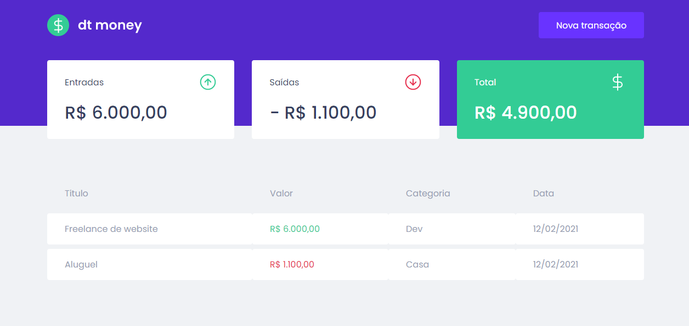
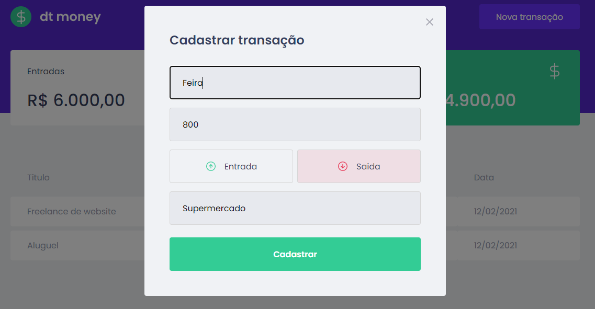

## 💰 Dt money

The purpose of this site is to control personal finances, the user enters the inputs and outputs and the website calculates the total.

This project was developed in the course of rocketseat.





## ✨ Tecnologies

- React
- Typescript
- Mirage js

## 🚀 How to run

- Clone the repository;
- In the cloned folder, install the dependencies with the following command:
  ```bash 
  yarn install
  ```
- Start the project with the command:
  ```bash
  yarn start
  ``` 

- Now access your browser and type: 
[`localhost:3000`](http://localhost:3000)
